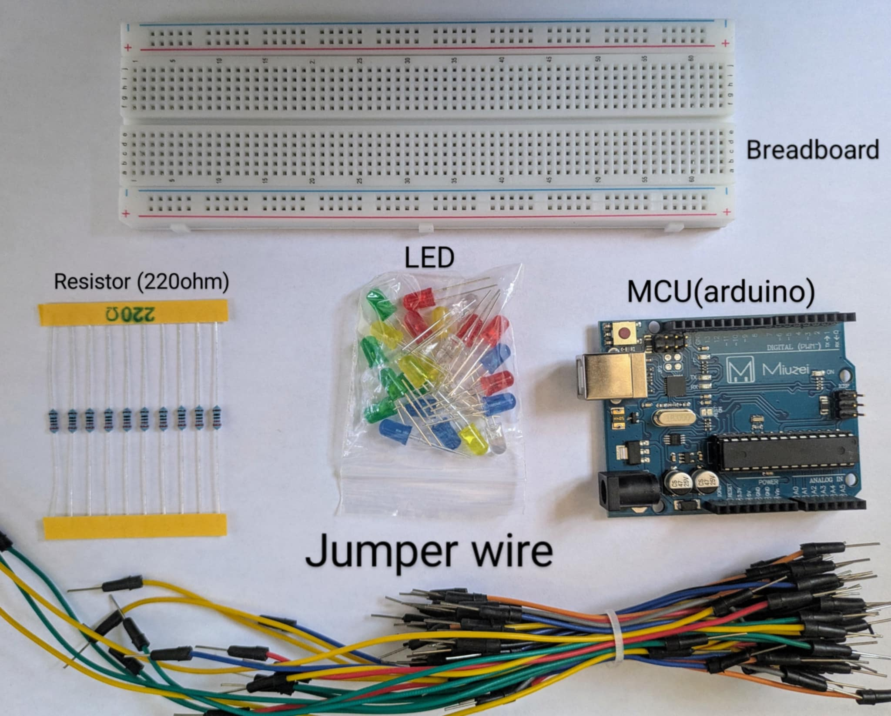

# Blinking-led-red
# Blinking Red LED - "Hello World" of Embedded Electronics

Welcome to my journey into the world of embedded systems. This is where it all begins—**a blinking red LED**. It's simple, sure, but it's the foundational "Hello World" for anyone serious about mastering electronics.

## 🧭 Why I'm Doing This
I’ve decided to become the kind of engineer who builds things from the ground up. Not just someone who plugs in modules and hopes for the best, but a real-deal, working-class tech wizard. My goal? To earn every ounce of knowledge, starting with the most basic building block: blinking a red LED.

### ⚠️ Lessons from the Start
You can’t just plug an LED into a battery. You’ll burn it out. The LED is a one-way street for current, and if you skip the resistor, it’s toast. This was my first electrical reality check: physics doesn’t care about your enthusiasm.

## 🔩 Parts I Used


## 🛠️ Wiring It Up


## [Watch ComponentsAssembly Video](https://www.youtube.com/watch?v=BwOe0xdcEr4)


## 🧠 My First Code
I used Arduino because it’s fast and friendly for beginners. Here’s what made my LED blink:
```cpp
int ledPin = 13; // Most boards have a built-in LED here

void setup() {
  pinMode(ledPin, OUTPUT);
}

void loop() {
  digitalWrite(ledPin, HIGH);
  delay(1000);
  digitalWrite(ledPin, LOW);
  delay(1000);
}
```

When that red light blinked for the first time, I felt like I'd just high-fived the universe.

## 🔥 Why This Moment Matters
This isn’t just a blinking light. It’s the spark. It means:
- I wrote code that made hardware move.
- I respected Ohm’s Law and won.
- I started something real.

## 📈 Where I'm Headed
This is just day one. Next up:
- Replace `delay()` with non-blocking timing
- Add a push-button to toggle the LED
- Try fading with PWM
- Blink multiple LEDs with different patterns

## 💬 Final Thoughts
Starting from the bottom isn’t glamorous, but it’s honest. If you’re reading this and thinking about learning electronics, stop waiting. Go buy a red LED and make it blink. You don’t need a fancy lab. You need commitment and grit.

---
